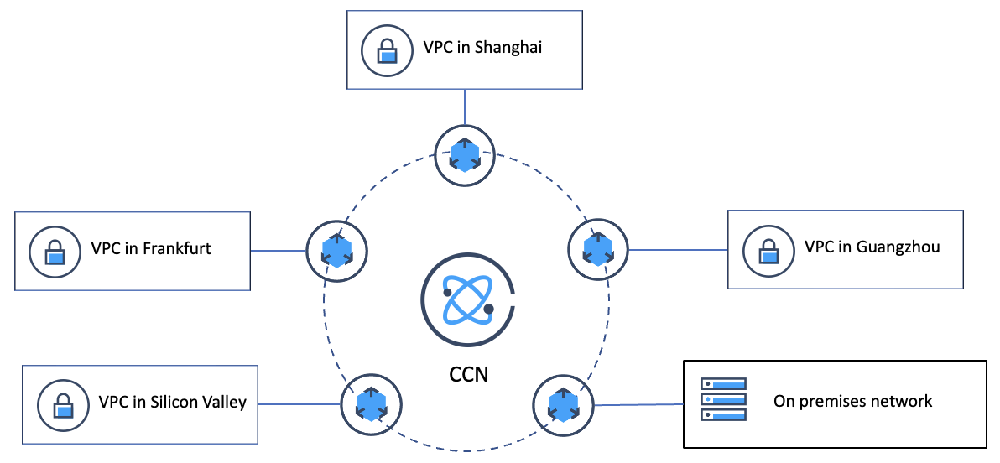

# Hub-SpokeTC

This Terraform creates a Hub & Spoke architecture on Tencent Cloud.

## Prerequisites
You must have the following ready

- Secret ID
- Secret Key 
- Terraform
- Tencent Cloud Account

To create Secret ID and Secret Key, please refer to https://www.tencentcloud.com/document/product/598/32675?lang=en 

For Terraform setup, please refer to https://developer.hashicorp.com/terraform/downloads 

## Architecture we are creating


## Components 
 - VPC : Frankfurt, Guangzhou, Singapore (others to be done)
 - Subnets
 - Security Groups and Rules
 - CCN (Cloud Connect Network) : allowing the differents VPC to cross-connect.
 - Tags for TC resources
 - Bastions instances (optional)

## How to run
```
$ export TENCENTCLOUD_SECRET_ID="my-secret-id"
$ export TENCENTCLOUD_SECRET_KEY="my-secret-key"

$ terraform init
$ terraform plan
$ terraform apply
```

For information, please check https://registry.terraform.io/providers/tencentcloudstack/tencentcloud/latest/docs
